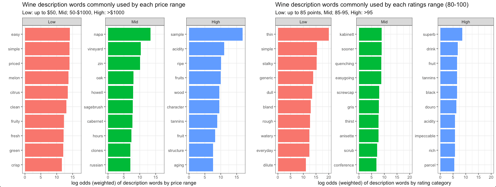

# wine-ratings

Using data from 2019, dig into some visualizations around the world of wine ratings.
Data Source: https://github.com/rfordatascience/tidytuesday/tree/master/data/2019/2019-05-28

# Data Dictionary
### `winemag-data-130k-v2.csv`

|variable              |class     |description |
|:---|:---|:-----------|
|country               |character | Country of origin |
|description           |character | Flavors and taste profile as written by reviewer |
|designation | character | The vineyard within the winery where the grapes that made the wine are from |
|points                |double    | The number of points WineEnthusiast rated the wine on a scale of 1-100 (though they say they only post reviews for wines that score >=80) |
|price                 |double    | The cost for a bottle of the wine |
|province              |character | The province or state that the wine is from|
|region_1              |character | The wine growing area in a province or state (ie Napa) |
|taster_name           |character | The taster/reviewer |
|title                 |character | The title of the wine review, which often contains the vintage (year) |
|variety               |character | Grape type |
|winery                |character | The winery that made the wine |

## What words are more likely to be used to describe to specific wine varieties?

Here we can use tidylo to look at the probabilities that individual words are used in a particular variety (Merlot, Chardonnay, etc), compared to the how often that word is used OUTSIDE of that variety. This gives us a list of language used to describe different wine types -- perfect if, like me, you have no idea what you're doing with wine other than enjoying it.  Fake your way through any fancy party with this easy trick:

## Do people describe higher-scoring wines the same way they describe lower-scoring ones?

Looking at some simple scatterplots, we can look at how description length changes relative to the wine point score. Here, it looks like higher-scoring wines do tend to use more words! It looks like there's no real difference in the word length, so people generally aren't using more complex words for better-scoring wine. 

What about the language that is used? If we assign categories to Low/Mid/High rated wines, what words are used? Let's look at the language used for price range, and for different point ratings on wines. Interesting -- the lower-rated wines seem to have almost sarcastic critical language associated with them; whereas lower-priced wines have more objective flavor descriptors. 

## Where are the best wines? The most expensive? The best bang-for-your-buck?

These were filtered down to include only wines that were less than $50, as there are some really expensive single bottles that were throwing off my visuals. So -- limiting the data to the set of wines that I might actually be willing to buy someday. 

Boxplots arranged by ratings and price show which wines consistently rate well -- noting countries like England and Canada have highly-rated, but expensive wines. Peru has lower-ratings, but also generally more inexpensive wines. What's interesting are the countries that have highly-rated, but inexpensive wines! If we look at the ratio of points to price, Ukraine, Romania, and India all have the most points-per-dollar, while England brings up the rear -- you really have to pay to get their highly-rated bottles!

## Do different types of wine follow the same patterns for rating vs price? 

These were filtered down to include only wines that were less than $50, as there are some really expensive single bottles that were throwing off my visuals. So -- limiting the data to the set of wines that I might actually be willing to buy someday. 

Boxplots arranged by ratings and price show which wines consistently rate well -- noting countries like England and Canada have highly-rated, but expensive wines. Peru has lower-ratings, but also generally more inexpensive wines. What's interesting are the countries that have highly-rated, but inexpensive wines! If we look at the ratio of points to price, Ukraine, Romania, and India all have the most points-per-dollar, while England brings up the rear -- you really have to pay to get their highly-rated bottles!

